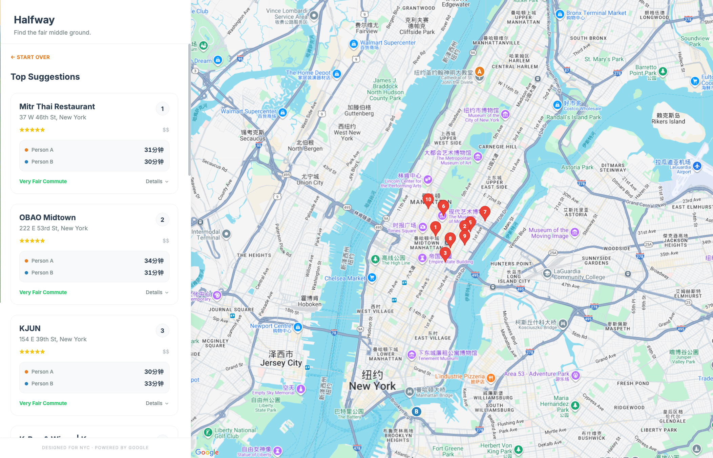

# Halfway

Find the perfect restaurant halfway between you and a friend – factoring in transit time, cuisine preferences, and price range.


## The Problem

You want to grab dinner with a friend, but you live in different neighborhoods. The usual negotiation:
- *"Let's meet near you"* → One person travels 40 minutes
- *"How about the middle?"* → But where even is that? And is there anything good there?

Halfway solves this by calculating a fair meeting point and surfacing highly-rated restaurants nearby, complete with transit times from both locations.

## Features

- **Smart midpoint calculation** – Geographic center between two addresses, or search within a specific neighborhood
- **Transit-aware** – Shows travel time via public transit from both starting points
- **Preference filters** – Cuisine type and price range ($–$$$$)
- **Interactive map** – Click markers to see restaurant details, ratings, and hours
- **NYC-optimized** – Factors in subway accessibility when calculating "Anywhere" midpoints

## Demo

<!-- Add a screenshot or GIF here -->


## Getting Started

### Prerequisites

You'll need a Google Maps API key with the following APIs enabled:
- Maps JavaScript API
- Places API
- Directions API
- Geocoding API

[Get an API key here](https://developers.google.com/maps/documentation/javascript/get-api-key)

### Installation

```bash
# Clone the repo
git clone https://github.com/BessiePengjinWang/halfway.git
cd halfway

# Install dependencies
npm install

# Start development server
npm run dev
```

Enter your API key when prompted in the app.

## How It Works

1. **Geocode** both addresses using Google's Geocoding API
2. **Calculate midpoint** – either geographic center or user-specified neighborhood
3. **Find nearby subways** (for "Anywhere" searches) to ensure transit accessibility
4. **Search restaurants** near the midpoint using Places API with cuisine/price filters
5. **Calculate transit times** from both origins to each restaurant via Directions API
6. **Render results** on an interactive map with detailed info cards

## Tech Stack

| Layer | Technology |
|-------|------------|
| Frontend | React 18, TypeScript |
| Styling | Tailwind CSS |
| Maps | Google Maps JavaScript API |
| APIs | Places API, Directions API, Geocoding API |
| Build | Vite |

## Project Structure

```
src/
├── App.tsx                 # Main app component & state management
├── components/
│   ├── Sidebar.tsx         # Search inputs & results list
│   └── ApiKeyModal.tsx     # API key entry modal
├── services/
│   └── googleMaps.ts       # All Google Maps API interactions
└── types.ts                # TypeScript interfaces
```

## Known Limitations

- **Two people only** – No support for 3+ person groups (yet)
- **NYC-centric** – Subway search logic assumes transit-friendly cities; less useful in car-dependent areas
- **API costs** – Users need their own Google Maps API key; can get expensive at scale
- **No persistence** – Refresh loses your search; no saved history
- **"Now" timing only** – Doesn't check if restaurants will be open at a future time
- **English only** – No internationalization

## Roadmap

- [ ] Support for 3+ people (centroid calculation)
- [ ] Shareable result links
- [ ] "I'm flexible" toggle (one person willing to travel further)
- [ ] Save favorite spots
- [ ] PWA support for mobile
- [ ] Walking/biking/driving mode toggle

## Contributing

Contributions welcome! Feel free to open an issue or submit a PR.

1. Fork the repo
2. Create your feature branch (`git checkout -b feature/amazing-feature`)
3. Commit your changes (`git commit -m 'Add amazing feature'`)
4. Push to the branch (`git push origin feature/amazing-feature`)
5. Open a Pull Request

## License

MIT License – see [LICENSE](LICENSE) for details.

## Acknowledgments

- Built out of frustration with the "where should we meet?" problem
- Inspired by countless group chat debates about restaurant locations
